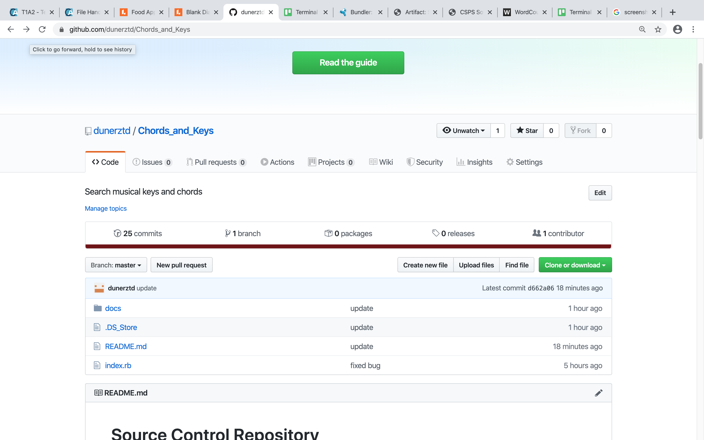
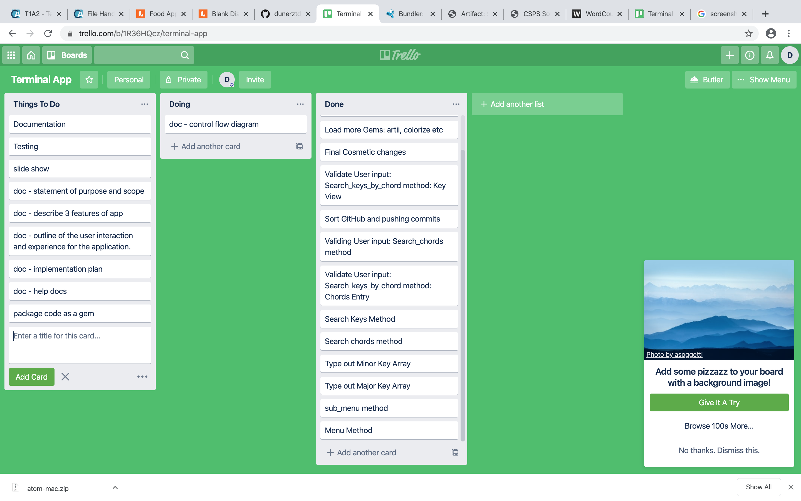

# Keys to the Chords

# Source Control Repository

https://github.com/dunerztd/Chords_and_Keys

(App may have a different name to what's on GitHub)

# Software Development Plan

## Purpose and Scope

This application is based on music theory, primarily keys and chords. It allows the user to enter one or multiple chords and will generate a list of keys based on the chords entered. Selecting one of the listed keys will display all chords associated with the key. From here it gives the option to display all the notes of an entered chord. Main menu and sub menus allow for easy navigation moving back and forward between keys and chords. Keys and chords can also be searched and displayed directly from the main menu.

The program will solve a range of problems. Songwriters need to know what key they are in to further develop songs. Western music and harmony is based around keys, chords and scales. Having the ability to identify the key a piece of music is in based on the chords being used will contribute heavily to songwriting. It allows the musician to expand their creation and develop as a songwriter. It's a useful learning tool to be come familiar with keys and their associated chords and by extension, music theory.

Musicians and amatuer song writers not familiar with music theory will be it's main audience. Beginners learning an instrument will get an introduction into theory. Professional musicians and those familiar with music theory can use it as a quick reference.

If a songwriter comes up with a piece based on a couple of chords, it will allow find out the full range of chords and notes to help a piece expand and sound complete. Key changes and other elaborate song writing will be possible.

## Features

There are three main features to this terminal application.

The first feature of the terminal application is the ability to search musical keys by a chord or chords contained in the keys. The code contains a long list of major and minor keys. When the user types in chords ie 'C' and 'G', the database is searched for any keys containing those chords. A list of keys are displayed, in this instance 'C Major', 'G Major', 'E Minor' and 'A Minor'. The user then can select any of these keys and a list of all the chords corresponding to that selected key are displayed. For further information about this key, the user can select any of the chords listed to find out which notes make up that chord. With the help of a sub menu, its easy to navigate between the found key and its accompanying chords.

The second feature is the ability to directly search for a key. From the main menu, the user can navigate to the search for a key item. Type in any major or minor key and all the chords associated with the key will be displayed. Similar to the first feature, a sub menu is displayed and the user can type in a chord to find the notes contained within said chord. From here it is simple to navigate back to the main menu.

The third feature is the ability to directly search for chords. From the main menu, the user can navigate to the search for a chord item. Any major or minor triad chord chord can be searched for. Simply typing in a ie. C, D#, Am will display the individual notes which make up the chord. The main menu will be displayed again to start the process over.

## User Interaction and Experience

On start up, the user will be prompted with a menu containing four items. These include: 1. Search for keys by chords, 2. Search Keys, 3. Search chord and 4. Exit. Unless 1, 2, 3 or 4 is entered, an error is displayed until the correct is given.

Typing '1' to select the 'Search key by chord' feature, the user will be prompted to enter chords(s) with an input example given. If the wrong input is given, an error will be continued to be displayed until the correct input is received.
The list of found keys is displayed and the user is prompted for their input. Unless the key is entered exactly as display it will through an error until correct. A list of chords contained in the key are displayed.
A sub menu is displayed and the user can select: 1. Select a chord, 2. Go Back or 3. Main Menu. The second option takes the user back the 'Search key by chord' screen and the third returns the user to the start of the application. Similar to the main menu, the sub menu will error until the correct input is given.
The first option takes the user to the 'Search chords' screen. It asks the user to enter a chord with an input example given. Only strict entries of C/Cm/C#m style will be accepted. An error will be repeatedly displayed until the correct input is given. The notes of the input are displayed and its followed by the sub menu again.

In the main menu, '2' is selected to enter the 'Search keys' feature. The user is prompted to input a single key. From here, this functions the same as above.

In the main menu, '3' is selected to enter the 'Search chords' feature. This functions the same as above.

## Application Control Flow

## Implementation Plan

### Listed by priority per feature

- Search Keys By Chord
  - Constructing .each/while/if statements (1 hour)
  - Key search (1 hour)
  - Displaying found key (20 mins)
  - Check if array is empty (5 mins)
  - Input error handling (2 hours)

- Search Keys
  - Search minor key array (20 mins)
  - Display chord if found (20 mins)
  - Search major key array (20 mins)
  - Display chord if found (20 mins)
  - Error handling if not found (1 hour)
  - Input error handling (1 hour)

- Search Chords
  - Prompting user for input (5 mins)
  - Implementing 'musique' gem (30 mins)
  - Looping through array (30 mins)
  - Displaying found chord (20 mins)
  - Input error handling (1 hour)

- Main Menu
  - Designing layout (30 mins)
  - Constructing while/case statements (20 mins)
  - Implementing 'colorize' gem to style menu (20 mins)

- Sub Menu
  - implementing 'colorize' gem to style menu (5 mins)

- Typing out major and minor key arrays (3 hours)

## Help Documentation

### This terminal application requires the following gems to operate:

- colorize (0.8.1)
- artii (2.1.2)
- musique (0.0.2)
- tty-prompt (0.21.0)
